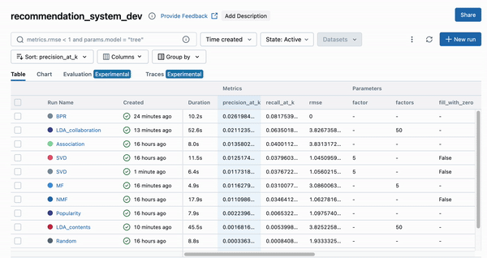

# MLflow-Based Machine Learning Experimentation for Recommendation Systems



This repository facilitates the experimentation and evaluation of machine learning models, primarily for recommendation systems using MLflow for tracking experiments. 

The project is structured around Docker containers, ensuring smooth orchestration and execution of model pipelines.


## Key Features

The diagram below shows the structure of this project:


This repository contains:


- **MLflow for Experiment Tracking:** Used to track machine learning experiments, log parameters, metrics, and store artifacts.

- **FTP Server for Artifact Storage:** Artifacts, such as model outputs, are stored on an FTP server.

- **PostgreSQL Database:** The MovieLens dataset (`ml-10m`) is migrated into a PostgreSQL database using Alembic migrations.


- **Machine Learning Model Pipelines:** Each machine learning model is structured as a pipeline. Pipelines read data from the database using SQL queries and SQLAlchemy, process the data, train models, and evaluate performance. Each pipeline is executed within its own Docker container, ensuring modularity and easy scaling. 


- **Docker Compose:** All containers (MLflow, FTP server, PostgreSQL, and pipeline execution) are orchestrated using Docker Compose for simplified management.


- **Backend with SQLite:** Utilizes an SQLite database mounted to a local volume as the backend for the MLflow tracking server. 


## Project Structure


The main code is under the `src/` directory, which contains the following modules:

```
. 
├── tests/ # Test code (tbc)
├── src/ 
│ ├── core/ 
│ ├── datareader/ 
│ ├── pipelines/ 
│ │ └──{model_name}/
│ │ │ ├── Dockerfile
│ │ │ ├── model.py
│ │ │ ├── pipeline_{model_name}.py
│ │ │ ├── pyproject.toml
│ │ │ └── pipeline_params.env
│ ├── sql/ 
│ ├── table_models/ 
│ └── utils/ 
├── docker-compose.yml 
├── README.md 
├── poetry.lock
├── DockerfileMlflow
├── alembic.ini
├── .env
└── pyproject.toml
```

The description of each file is as below: 


- `core/`: Loads environment variables using Pydantic settings.
- `datareader/`: Contains modules to read data from the database.
- `pipelines/`: Contains pipelines and models for different machine learning experiments. Each pipeline consists of the following components:
    
    - `Dockerfile`: Used to launch the container for the pipeline.
    - `model.py`: Contains the code for the machine learning model.
    - `pipeline_{model_name}.py`: Contains the code for the specific pipeline corresponding to the model. Use MLflow modules to record the parameters being used and the evaluation results (i.e., the metrics). 
    - `pyproject.toml`: Defines the environment and dependencies for the container.
    - `pipeline_params.env`: Stores the environment variables used in the pipeline.


- `sql/`: Stores SQL queries used for data extraction and transformation.
- `table_models/`: Defines database models using SQLAlchemy. Also include the code to execute the migration. 
- `utils/`: Contains various helper functions to support other modules.
- `alembic/`: Code to execute migrations. 
- `DockerfileMlflow`: Defines the instructions to build Docker images MLflow. 
- `docker-compose.yml`: Orchestrates multiple Docker containers (MLflow, PostgreSQL, FTP, and pipelines) to run the entire system seamlessly.
- `poetry.lock` / `pyproject.toml`: Lists the Python dependencies needed for the project.
- `alembic.ini`: Handles the database migrations for loading the MovieLens dataset into PostgreSQL.
- `.env`: Stores environment variables such as database credentials and configuration settings.


## Data and Models Overview

### Dataset Split

The dataset is split based on time. The last 5 movies rated by each user are used as the test data.

You can find the algorithm for splitting the data in the `sql/integrated_tables.sql` file. The part responsible for splitting is as below: 


```sql
-- split the data into test and training data
ranked_data AS (
    SELECT 
        user_id, 
        ...
        timestamp, 
        ROW_NUMBER() OVER (PARTITION BY user_id ORDER BY timestamp desc) AS rank
    FROM 
        all_data
), split_data AS (
SELECT
    ...
    CASE
        WHEN rank <= 5 THEN 'test'
        ELSE 'train'
    END AS label
FROM
    ranked_data
    ...
)

```


### Recommender Models in this Project


This project features several recommendation models that serve as the core of the machine learning pipeline. You can find the implementation of each model in the `model.py` file within each pipeline directory.


|Model|Description|File Link|
|:-|:-|:-|
|Random Recommendation|Recommends movies at random, without utilizing any user or movie information.|[model.py](src/pipelines/random/model.py)|
|Popularity Recommendation|Suggests movies that are widely popular across all users.|[model.py](src/pipelines/popularity/model.py)|
|Association Recommendation|Recommends movies that are frequently rated together by users.|[model.py](src/pipelines/association/model.py)|
|User-based Memory-based Collaborative Filtering (UMCF)| Recommends movies by identifying similarities between users' preferences.|[model.py](src/pipelines/UMCF/model.py)|
|SVD (Singular Value Decomposition)|Uses latent factors derived from SVD to recommend movies based on user-item interactions.|[model.py](src/pipelines/SVD/model.py)|
|NMF (Non-Negative Matrix Factorization)|Similar to SVD, but restricts factors to non-negative values, making recommendations interpretable.|[model.py](src/pipelines/NMF/model.py)|
|MF (Matrix Factorization)|Optimizes user and movie vectors to find the best latent representations for recommendations.|[model.py](src/pipelines/MF/model.py)|
|IMF (Implicit Matrix Factorization)|Recommends movies based on implicit feedback, using hidden factors from implicit interactions.|[model.py](src/pipelines/IMF/model.py)|
|BRP (Bayesian Personalized Ranking)|Assumes users prefer rated movies over unrated ones, optimizing for ranking quality.|[model.py](src/pipelines/BPR/model.py)|
|LDA (Content-Based Filtering)|Uses Latent Dirichlet Allocation to recommend movies based on content similarities.|[model.py](src/pipelines/LDA_contents/model.py)|
|LDA (Collaborative Filtering)|Applies LDA to collaborative filtering, recommending movies based on patterns in user behavior.|[model.py](src/pipelines/LDA_collaboration/model.py)|


### Metrics
To evaluate the performance of the pipelines, we use the following general-purpose metrics:

|Metric|Description|Meaning|
|:-|:-|:-|
|RMSE (Root Mean Squared Error)|Measures the difference between the predicted and actual rating values.|A lower RMSE indicates better model performance.|
|Recall@k|Evaluates how many of the top `k` recommended movies match the true top `k` movies for each user.|Higher Recall@k value indicates higher ability to retrieve relevant items.|
|Precision@k|Measures the proportion of the top `k` recommended movies that are relevant, compared to the true top `k` movies.|Higher Precision@k value indicates higher ability to retrieve relevant items.|

**Note:** Some pipelines may not use all of these metrics due to the specific characteristics of the algorithms employed.


## How to Run


### Prerequisites

Make sure you have the following installed:

- `Python 3.11` or higher
- `poetry` for dependency management
- `Docker` and `Docker Compose` for container orchestration


### Steps to run the system

1. Clone this repository:

    ```shell 
    git clone https://github.com/phlin0424/recommendation_practice
    ```

2. Place the MovieLens dataset (`ml-10m`) under `./data`: 

    ```shell 
    # Ensure that you have the following files under ./data/ml-10m
    ls  ./data/ml-10m 
    README.html      allbut.pl        movies.dat       ratings.dat      split_ratings.sh tags.dat
    
    ```


3. Start all necessary services (MLflow, PostgreSQL, FTP, etc.) using Docker Compose:
    ```
    docker-compose up
    ```

4. Execute the migration and populate the data to the database container: 

    ```shell
    # Install all the decencies using poetry: 
    poetry install

    # Create the initial tables for the dataset: 
    alembic revision --autogenerate -m "Create initial tables"

    # Populate the dataset to DB:
    poetry run python table_models/ml_10m/migrate_data.py
    ```


4. To run a machine learning pipeline (train and evaluate a model), use:

    ```shell
    # Run the SVD recommender pipeline for example: 
    docker-compose --profile pipeline_svd up
    ```

### Expected Results

By following the provided steps, a new run will be created in MLflow. You can view the logged metrics, pipeline parameters, and the trained model (saved as a `.pkl` file), which is stored as an artifact on the FTP server and tracked in MLflow.


## License

This project is licensed under the MIT License - see the [LICENSE](LICENSE) file for details.
